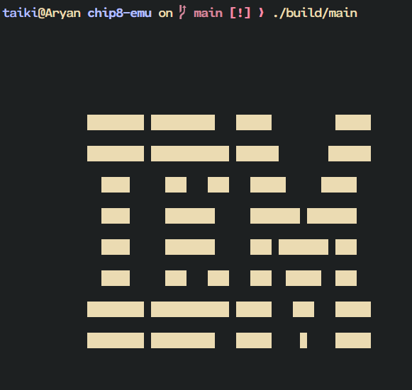
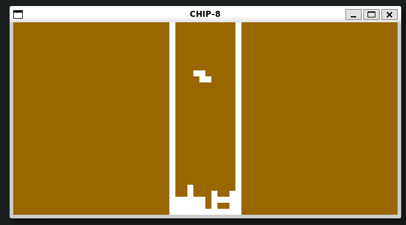
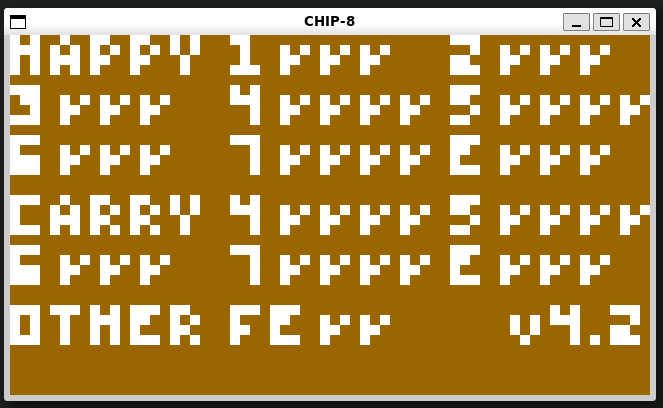

# Yet Another Chip-8 Emulator

A simple CHIP-8 emulator written in `C++` using `raylib`. This project was built to learn about emulator developmentand has since grown to support multiple CHIP-8 variants, including Super-CHIP (SCHIP) and XO-CHIP.

<p align="center">
  
</p>

<p align="center">
  
</p>

<p align="center">
  
</p>


## Architecture

### Memory

1. Had 4096 (`0x1000`) memory locations, all of which are 8 bits  
3. Chip-8 interpreter occupies the first 512 bytes of memory on these machines  

### Registers

1. Had 16 8-bit registers named V0 to VF.  
2. VF is also used as flag (carry/collision)  
3. Address register `I` is 12 bits wide and used with several opcodes.  
4. One program counter PC  
5. One stack pointer SP

### Stack

1. ONLY used to return addresses when subroutines are called.  
2. Size: 16 levels  
3. Used by:  
- `2NNN` (CALL)  
- `00EE` (RETURN)

### Timers

1. 2 8 bit timers  
2. Delay Timer (DT)  
    - Counts down at 60HZ  
    - Used for timing  
3. Sound Timer (ST)  
    - Counts down at 60HZ  
    - Plays a beep _while_ greater than zero

### Input

1. CHIP-8 has a hexadecimal keypad with 16 keys  
     
   1 2 3 C  
   4 5 6 D  
   7 8 9 E  
   A 0 B F  
2. 8, 4, 6 and 2 keys are typically used for directional input.  
3. Opcodes are used to detect inputs

### Display

1. Original Display:  
   - Resolution: 64x32  
   - Monochrome  
2. Sprites:  
1. 8 pixels wide  
2. 1-15 pixel tall  
3. Drawn using XOR (what??)  
4. If drawing erases a pixel, VF \= 1

### Opcodes

1. Has 35 opcodes which are 2 bytes long and stored in big-endian  
     

## Super-CHIP Changes

Super-CHIP (SCHIP) extends the original CHIP-8 with several new features:

### Display
- High-resolution mode (`128×64`)
- Low-resolution compatibility mode (`64×32`)
- Screen scrolling instructions
  - Scroll right
  - Scroll left
  - Scroll down

## XO-CHIP Changes

XO-CHIP further extends Super-CHIP with additional graphics, memory, and audio capabilities.

### Memory
- Expanded address space (up to 64 KB)
- Supports loading larger programs.

### Display
- Two graphics planes
- Plane selection instructions
- Extended sprite drawing

### Audio
- 16-byte audio pattern buffer
- Programmable sound playback

> Audio stuff is tested exclusively on windows, cause i couldnt get PulseAudio to be working on WSL2.

## Build

### Prerequisites

- C++20 compatible compiler (`g++`)
- `make`
- `raylib`

The Makefile assumes raylib is built from source and located at:

```
~/code/raylib
```

If your installation is elsewhere, update the `INCLUDES` and `LIBS` variables in the Makefile.

### Compile

```bash
make
```

The executable will be created as:

```
build/main
```

### Run

Run with the default ROM:

```bash
make run
```

Run a specific ROM:

```bash
make run ROM="roms/PONG.ch8"
```

or execute the binary directly:

```bash
./build/main "roms/PONG.ch8"
```

### Debug Build

```bash
make debug
```

### Clean

```bash
make clean
```

### REFERENCES
http://devernay.free.fr/hacks/chip8/C8TECH10.HTM

https://en.wikipedia.org/wiki/CHIP-8

https://tobiasvl.github.io/blog/write-a-chip-8-emulator/

https://johnearnest.github.io/Octo/docs/XO-ChipSpecification.html

https://github.com/raysan5/raylib

https://github.com/Timendus/chip8-test-suite (super helpful)